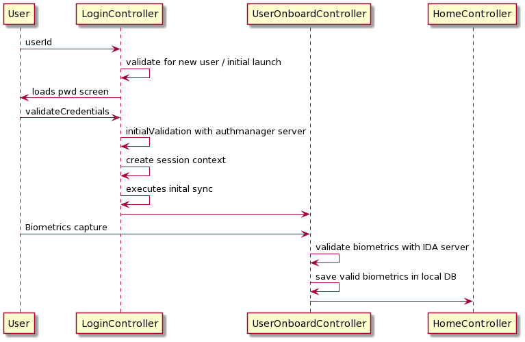

# Design - On board User

## Background

Through the administrative portal operator and machines are mapped to the respective centers; but in-order to use the registration client application installed in the machines the users need to first on-board into the registration client. During this on-boarding process the operators have to provide their biometrics which would be verified against their UINs using the authentication module [IDA]. After authentication is successful the biometrics of the opertors are stored in the local storage to perform local authentication and de-duplication in registration client.

## Target Users

- Registration Officer
- Registration Supervisor

## Key Requirements

User Mapping:

The default userid screen will be displayed to the user for login.
After provided userid, the validation will be validated against the local master data and also validate the machine mapping information. 
If the machine mapping to the entered userid is not mapped then it will route to the password screen. After provided the password it will be validated with the MOSIP online system and after successful validation it will call the OPTService to generate the OTP to the user registered mobile number.
 
The User can enter the same OTP which was received and will be validate against the OTPValidation Service. After successful authentication the system route to the On board User mapping screen, by providing the bio-metric[Fingerprint/Iris/Photo] information and the same information will be validate against the MOSIP server Authentication module [IDA] and get the success or failure flag. Based on the success or failure flag, the system should allow the user to get onboarded into the application and persists the users bio-metric information locally for de-dupe validation.  

The user can use the menu option "Update User Bio-Metirc" to update the latets bio-metrics if online alone. If the valdiation succeess as like above then the new values will be persisted otherwise older values will be retained in the system.

**Pre-requisite**

1. The user/password sync should have happened from Admin to client desktop machine.    
2. System configuration sync should have happened from Admin to client machine.   
3. The system should have online connectivity with the MOSIP server.  
4. The client id and secret key should be available at desktop to get the token from the server and the same would be used for further authentication.   

The key **non-functional requirements** are  

- Security:
 	- Should not store any sensitive information as plain text
        information.
	-The data which resides in the data-base should be in encrypted
        format.

- Network:
   - Should able to communicate to the configured REST URL with
        proper authentication.
   - The http read timeout parameter to be explicitly set, if client
        unable to connect to the REST service.
   - Connectivity should happen through SSL mode. The respective key
        to be loaded during the call.

**Solution**  

The key solution considerations are --

**Service **

- **LoginController.java**
	To validate the userid/password and which was enter by the user.
- **RegistrtaionUserDetailRepository.java**
	To get the user detail information [including the password].
- **OTPService [Online Service]**
	To generate and validate the OTP which was entered by the User
- **Bio-metric Authentication Service [Online Service]**
	To validate the Bio-metric information provided by the user.
- **UserBiometricRepostiry.java**
	To capture the validated bio-metric into the local DB of client.
-  **BiometricException.java**
	To capture the exception related information to capture.
	
-   Handle exceptions in using custom Exception handler and send correct
    response to client.

**Class Diagram:**

**Sequence Diagram:**

  Sequence flow in bio-metric authentication during user On boarding:  
  1. Check for online connectivity before doing device scanning. 
  2. Once online, does the following process:
    - Invoke the 'keymanager/getPublicKeyUsingGET' service to get the MOSIP auth specific public key from server. [Online service - store it in memory]
    - Connect to the Device through MDM services and capture the bio-metric data provided by the user.  
    - Generate Hash of request data using HMAC util. [SHA 256]
    - Generate Session key [using kernel api - Keymanager.getSymmetricKey()] and Encrypt this key using 'MOSIP auth specific' public key. 
    - Encrypt the Hash value using session key using kernel library.  
    - Encrypt the session key using Public key > [EncryptorImpl.asymmetricPublicEncrypt()].  
    

