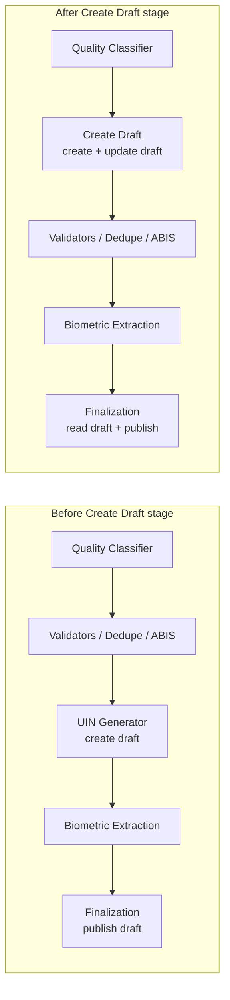
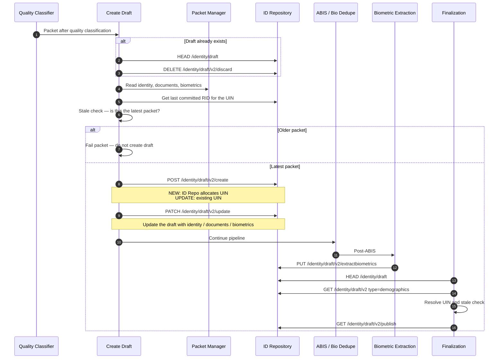
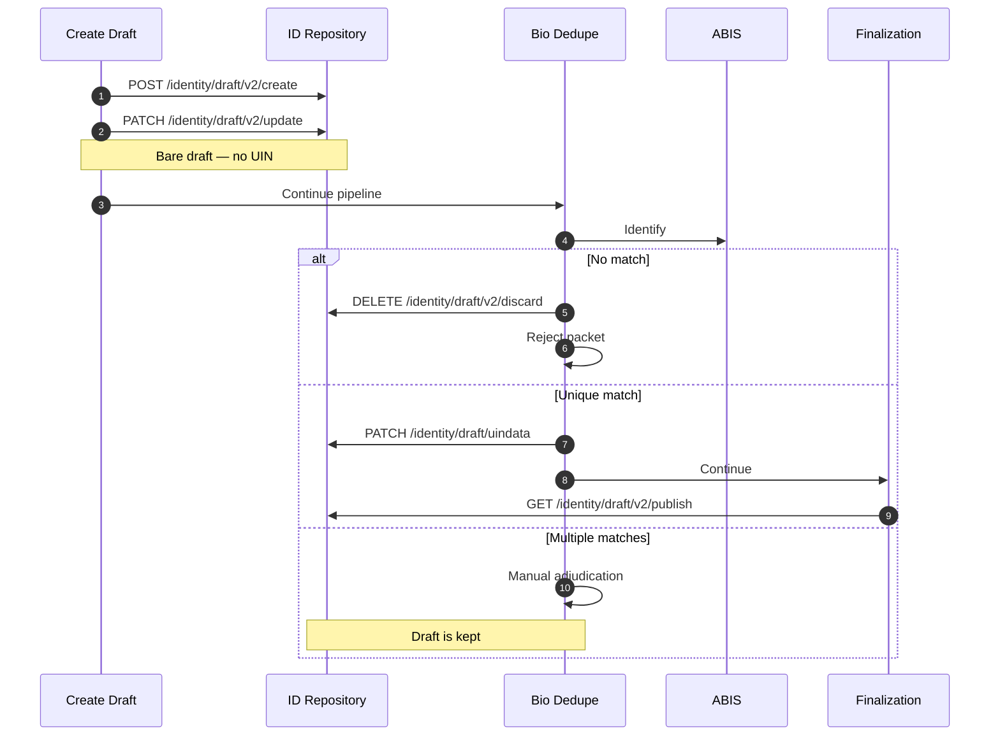
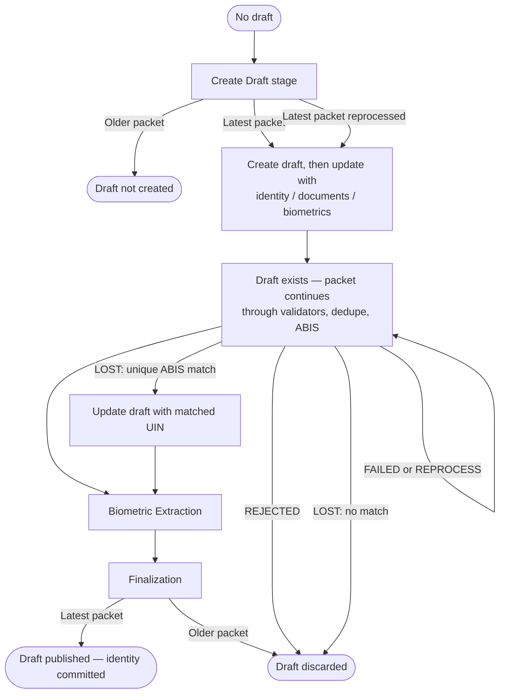
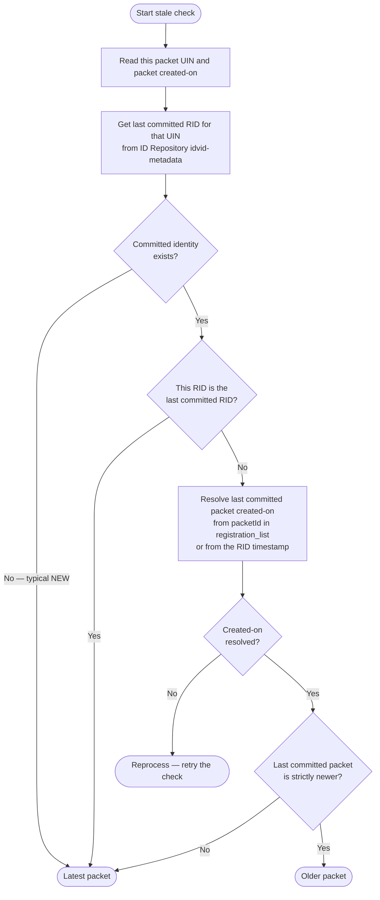

# Create Draft Stage Flow

## Overview

Draft creation is moved earlier in the pipeline. A dedicated **Create Draft** stage (stage-group-2) creates and populates the ID Repository draft **before ABIS**. Post-ABIS stages then use that draft instead of Packet Manager. **UIN Generator is no longer deployed** in stage-group-7.

Camel route XML lives in the config server (`mosip-config`), not in this repository. Create Draft is placed **after Quality Classifier**.

---

## Problem

Before this change, the ID Repository draft was created late — in **UIN Generator**, after ABIS. Later stages still read identity, documents, and biometrics from **Packet Manager**.

Packet Manager decrypts the packet and caches the result. If ABIS is slow or down for a long time, that cache expires before post-ABIS stages run. Each expired post-ABIS packet then needs a **fresh decryption**. At the same time, new packets in pre-ABIS stages also need decryption. Packet Manager is then loaded with both:

- **Fresh packets** still before ABIS (first decryption)
- **Post-ABIS packets** whose cache has expired (decrypt again)

That overload slows Packet Manager and the rest of the pipeline, not only the packet that waited on ABIS.

---

## Approach

1. **Create Draft stage** reads the packet once (identity, documents, biometrics) and writes an ID Repo draft **before ABIS**.
2. **ID Repository** provides a new `/v2` API version for get, create, update, extract, and publish draft operations.
3. **Post-ABIS stages** read or update the draft and avoid Packet Manager where possible. Finalization mainly publishes the draft that was already filled.
4. **LOST** creates a draft without UIN. Bio Dedupe stamps the matched UIN after ABIS, or discards the draft if there is no match.
5. **Workflow Manager** discards the draft only when the packet is **REJECTED**. FAILED and REPROCESS keep the draft so the packet can continue without re-running Create Draft.

---

## Packet-type behaviour in Create Draft

| Packet type | Draft create | UIN |
|-------------|--------------|-----|
| **NEW** | Create draft, then update the draft with identity / documents / biometrics | ID Repo allocates UIN |
| **UPDATE / RES_UPDATE** | Create draft for the existing UIN, then update the draft with identity / documents / biometrics | UIN taken from the packet |
| **ACTIVATED / DEACTIVATED** | Create draft for the existing UIN with the corresponding status, then update the draft | UIN taken from the packet |
| **LOST** | Create a bare draft with allowed demographic fields only | No UIN at create. Bio Dedupe stamps UIN after a unique ABIS match |

If a draft already exists for the RID, Create Draft **discards it and recreates** it.

---

## ID Repository draft APIs used

ID Repository exposes a `/v2` API version for get, create, update, extract, and publish draft.

| API | HTTP | When used |
|-----|------|-----------|
| `/idrepository/v1/identity/draft` | HEAD | Check whether a draft exists for the RID (200 = exists, 204 = none) |
| `/idrepository/v1/identity/draft/v2/create` | POST | Create draft |
| `/idrepository/v1/identity/draft/v2` | GET | Read draft. Optional `type` (for example `demographics` in Finalization) |
| `/idrepository/v1/identity/draft/v2/update` | PATCH | Update the draft with identity / documents / biometrics |
| `/idrepository/v1/identity/draft/uindata` | PATCH | Stamp resolved UIN on a LOST draft |
| `/idrepository/v1/identity/draft/v2/extractbiometrics/` | PUT | Biometric extraction on the existing draft |
| `/idrepository/v1/identity/draft/v2/publish` | GET | Publish draft to ID Repo (Finalization) |
| `/idrepository/v1/identity/draft/v2/discard/` | DELETE | Discard the draft |

---

## Stage flow (before vs after)

Create Draft is bundled in **stage-group-2**. Stage-group-7 now contains Biometric Extraction, Finalization, and Credential Requestor only.

---

## Sequence: NEW / UPDATE (happy path)

---

## Sequence: LOST packet

---

## Draft lifecycle

The draft is created once before ABIS, carried through the rest of the flow, and then either **published** (success) or **discarded** (REJECTED, LOST no-match, or older packet at Finalization). An **older packet at Create Draft never gets a draft**. FAILED and REPROCESS do not discard an existing draft.

Read the diagram as:

- **Down the centre:** happy path — create → ABIS → extract → publish.
- **Left branch:** LOST unique match stamps UIN, then the same extract/publish path.
- **Create Draft + older packet:** draft is **not created**.
- **Finalization + older packet, REJECTED, or LOST no-match:** draft is **discarded**.
- **FAILED / REPROCESS:** stay on the existing draft so the packet can resume.

---

## Reprocessing behaviour change

### Latest packet is allowed for reprocessing

Only the **latest packet** for a UIN is allowed to continue (or to be reprocessed). Create Draft may run again for that packet: any existing draft is discarded and a new draft is created from the packet.

FAILED and REPROCESS **keep** the draft so the latest packet can resume after ABIS without calling Packet Manager again and without re-running Create Draft.

### Older packet is not allowed to reprocess

An **older packet** for the same UIN is not allowed to create, update, or publish a draft. If a newer packet is already committed in ID Repository, the older packet is marked obsolete. Create Draft does not create a draft; Finalization discards the draft that already exists and does not publish it.

### How latest vs older is determined

Create Draft (before creating the draft) and Finalization (before publishing) use the same check:

- **Latest packet:** Create Draft creates and updates the draft; Finalization publishes it.
- **Older packet:** Create Draft does **not** create a draft; Finalization **discards** the existing draft and does not publish.
- **Reprocess:** created-on could not be resolved — retry the check.

---

## Post-ABIS draft usage guideline

Packet Manager usage **after ABIS must be restricted**. Decrypting the packet again after a long ABIS wait (cache expiry) competes with fresh pre-ABIS packets and slows the whole system.

Guideline:

- **Before ABIS:** put all identity, documents, biometrics, and other data the later stages need into the ID Repo draft (Create Draft, and any later pre-ABIS enrichment).
- **After ABIS:** prefer **publish** of that draft. Do not call Packet Manager for data that is already on the draft.
- **If a post-ABIS stage needs data:** read it from the draft (`/identity/draft/v2`, with `type` when only a subset is needed).
- **If a new field is required post-ABIS:** add it to the draft in Create Draft (or another pre-ABIS stage) instead of introducing a new Packet Manager read after ABIS.

Finalization follows this: UIN comes from the draft (`type=demographics`); packet created-on for the stale check comes from RID / packetId, not Packet Manager.

---

## Configuration (Create Draft)

These properties are read by Create Draft from the config server:

| Property | Role |
|----------|------|
| `mosip.regproc.create.draft.message.expiry-time-limit` | Event-bus message expiry |
| `mosip.regproc.create.draft.lost.packet.allowed.update.fields` | Demographic fields allowed on a LOST draft |
| `mosip.regproc.create.draft.trim-whitespaces.simpleType-value` | Trim simple-type values before writing the draft |

---

## Notes

1. The **UIN Generator** module is still in this repository but is **not** a dependency of stage-group-7. Runtime draft creation is Create Draft.
2. Exact Camel route XML for inserting `create-draft-bus-in` / `create-draft-bus-out` is maintained in **mosip-config**.
3. Create Draft discards an existing draft before recreate so a reprocess of the latest packet does not merge into an old draft.
