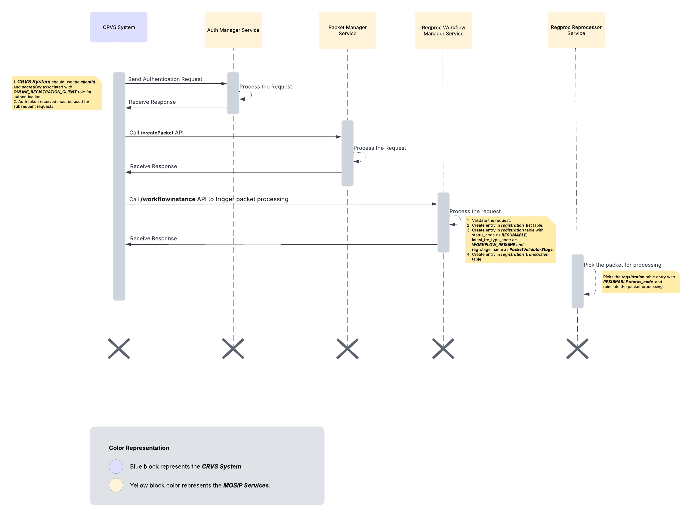

# CRVS - MOSIP Integration
## Overview
The document describes the integration flow between the CRVS and MOSIP.
## Prerequisites
**_clientId_** and **_secretKey_** must be created associated with the **_ONLINE_REGISTRATION_CLIENT_** role.
## Integration Flow
1. **CRVS System Authentication:** CRVS system must authenticate using the **_clientId_** and **_secretKey_** associated with the **_ONLINE_REGISTRATION_CLIENT_** role. On successful authentication, CRVS system receives the authentication token in response which must be used in subsequent APIs for authentication.
2. **Create Packet:** CRVS system should invoke the **_/createPacket_** API of packet manager along with required arguments and authentication token as per the API specification inorder to generate the packet for CRVS system use cases such as Birth registration and death registration.
3. **Trigger Packet Processing:** Once packet is created successfully, in order to trigger the packet processing, CRVS system should invoke the **_/workflowinstance_** API of workflow manager service of registration processor module with required arguments and authentication token as per the API specification. This API does below:
   1. It creates the entry in **_registration_list_** table with required information.
   2. It creates the entry in the **_registration_** table with required information along with **_status_code_** as **_RESUMABLE_**, **_latest_trn_type_code_** as **_WORKFLOW_RESUME_** and **_reg_stage_name_** as **_PacketValidatorStage_**.
   3. It creates entry in the **_registration_transaction_** table with required information.
4. Re-processor service of registration processor module picks up the registration table entry with **_RESUMABLE_** **_status_code_** and triggers the packet processing. Re-processor service runs with predefined interval.

## Sequence Diagram
